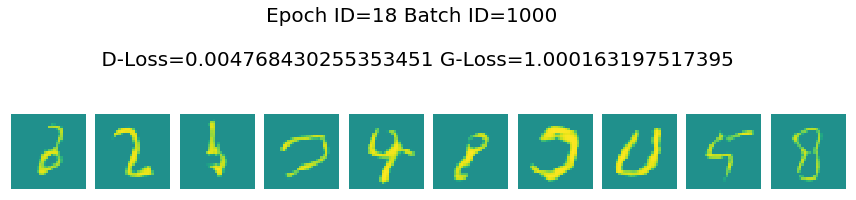
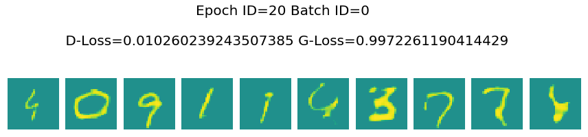

## 将第一节课实践的DCGAN代码改成lsgan的损失函数

可以看下有提示的地方。


```python
#导入一些必要的包
import os
import random
import paddle 
import paddle.nn as nn
import paddle.optimizer as optim
import paddle.vision.datasets as dset
import paddle.vision.transforms as transforms
import numpy as np
import matplotlib.pyplot as plt
import matplotlib.animation as animation
```

    /opt/conda/envs/python35-paddle120-env/lib/python3.7/site-packages/matplotlib/__init__.py:107: DeprecationWarning: Using or importing the ABCs from 'collections' instead of from 'collections.abc' is deprecated, and in 3.8 it will stop working
      from collections import MutableMapping
    /opt/conda/envs/python35-paddle120-env/lib/python3.7/site-packages/matplotlib/rcsetup.py:20: DeprecationWarning: Using or importing the ABCs from 'collections' instead of from 'collections.abc' is deprecated, and in 3.8 it will stop working
      from collections import Iterable, Mapping
    /opt/conda/envs/python35-paddle120-env/lib/python3.7/site-packages/matplotlib/colors.py:53: DeprecationWarning: Using or importing the ABCs from 'collections' instead of from 'collections.abc' is deprecated, and in 3.8 it will stop working
      from collections import Sized
    2021-04-17 16:12:21,820 - INFO - font search path ['/opt/conda/envs/python35-paddle120-env/lib/python3.7/site-packages/matplotlib/mpl-data/fonts/ttf', '/opt/conda/envs/python35-paddle120-env/lib/python3.7/site-packages/matplotlib/mpl-data/fonts/afm', '/opt/conda/envs/python35-paddle120-env/lib/python3.7/site-packages/matplotlib/mpl-data/fonts/pdfcorefonts']
    2021-04-17 16:12:22,184 - INFO - generated new fontManager


```python
dataset = paddle.vision.datasets.MNIST(mode='train', 
                                        transform=transforms.Compose([
                                        # resize ->(32,32)
                                        transforms.Resize((32,32)),
                                        # 归一化到-1~1
                                        transforms.Normalize([127.5], [127.5])
                                    ]))

dataloader = paddle.io.DataLoader(dataset, batch_size=32,
                                  shuffle=True, num_workers=4)
```

    Cache file /home/aistudio/.cache/paddle/dataset/mnist/train-images-idx3-ubyte.gz not found, downloading https://dataset.bj.bcebos.com/mnist/train-images-idx3-ubyte.gz 
    Begin to download
    
    Download finished
    Cache file /home/aistudio/.cache/paddle/dataset/mnist/train-labels-idx1-ubyte.gz not found, downloading https://dataset.bj.bcebos.com/mnist/train-labels-idx1-ubyte.gz 
    Begin to download
    ........
    Download finished


```python
#参数初始化的模块
@paddle.no_grad()
def normal_(x, mean=0., std=1.):
    temp_value = paddle.normal(mean, std, shape=x.shape)
    x.set_value(temp_value)
    return x

@paddle.no_grad()
def uniform_(x, a=-1., b=1.):
    temp_value = paddle.uniform(min=a, max=b, shape=x.shape)
    x.set_value(temp_value)
    return x

@paddle.no_grad()
def constant_(x, value):
    temp_value = paddle.full(x.shape, value, x.dtype)
    x.set_value(temp_value)
    return x

def weights_init(m):
    classname = m.__class__.__name__
    if hasattr(m, 'weight') and classname.find('Conv') != -1:
        normal_(m.weight, 0.0, 0.02)
    elif classname.find('BatchNorm') != -1:
        normal_(m.weight, 1.0, 0.02)
        constant_(m.bias, 0)
```


```python
# Generator Code
class Generator(nn.Layer):
    def __init__(self, ):
        super(Generator, self).__init__()
        self.gen = nn.Sequential(
            # input is Z, [B, 100, 1, 1] -> [B, 64 * 4, 4, 4]
            nn.Conv2DTranspose(100, 64 * 4, 4, 1, 0, bias_attr=False),
            nn.BatchNorm2D(64 * 4),
            nn.ReLU(True),
            # state size. [B, 64 * 4, 4, 4] -> [B, 64 * 2, 8, 8]
            nn.Conv2DTranspose(64 * 4, 64 * 2, 4, 2, 1, bias_attr=False),
            nn.BatchNorm2D(64 * 2),
            nn.ReLU(True),
            # state size. [B, 64 * 2, 8, 8] -> [B, 64, 16, 16]
            nn.Conv2DTranspose( 64 * 2, 64, 4, 2, 1, bias_attr=False),
            nn.BatchNorm2D(64),
            nn.ReLU(True),
            # state size. [B, 64, 16, 16] -> [B, 1, 32, 32]
            nn.Conv2DTranspose( 64, 1, 4, 2, 1, bias_attr=False),
            nn.Tanh()
        )

    def forward(self, x):
        return self.gen(x)


netG = Generator()
# Apply the weights_init function to randomly initialize all weights
#  to mean=0, stdev=0.2.
netG.apply(weights_init)

# Print the model
print(netG)
```

    Generator(
      (gen): Sequential(
        (0): Conv2DTranspose(100, 256, kernel_size=[4, 4], data_format=NCHW)
        (1): BatchNorm2D(num_features=256, momentum=0.9, epsilon=1e-05)
        (2): ReLU(name=True)
        (3): Conv2DTranspose(256, 128, kernel_size=[4, 4], stride=[2, 2], padding=1, data_format=NCHW)
        (4): BatchNorm2D(num_features=128, momentum=0.9, epsilon=1e-05)
        (5): ReLU(name=True)
        (6): Conv2DTranspose(128, 64, kernel_size=[4, 4], stride=[2, 2], padding=1, data_format=NCHW)
        (7): BatchNorm2D(num_features=64, momentum=0.9, epsilon=1e-05)
        (8): ReLU(name=True)
        (9): Conv2DTranspose(64, 1, kernel_size=[4, 4], stride=[2, 2], padding=1, data_format=NCHW)
        (10): Tanh()
      )
    )


在这里需要修改一下激活函数

将原来的`Sigmoid`修改成`leakyRELU`


```python
class Discriminator(nn.Layer):
    def __init__(self,):
        super(Discriminator, self).__init__()
        self.dis = nn.Sequential(

            # input [B, 1, 32, 32] -> [B, 64, 16, 16]
            nn.Conv2D(1, 64, 4, 2, 1, bias_attr=False),
            nn.LeakyReLU(0.2),

            # state size. [B, 64, 16, 16] -> [B, 128, 8, 8]
            nn.Conv2D(64, 64 * 2, 4, 2, 1, bias_attr=False),
            nn.BatchNorm2D(64 * 2),
            nn.LeakyReLU(0.2),

            # state size. [B, 128, 8, 8] -> [B, 256, 4, 4]
            nn.Conv2D(64 * 2, 64 * 4, 4, 2, 1, bias_attr=False),
            nn.BatchNorm2D(64 * 4),
            nn.LeakyReLU(0.2),

            # state size. [B, 256, 4, 4] -> [B, 1, 1, 1]
            nn.Conv2D(64 * 4, 1, 4, 1, 0, bias_attr=False),
            # 这里为需要改变的地方
            # nn.Sigmoid()
            nn.LeakyReLU()
        )

    def forward(self, x):
        return self.dis(x)

netD = Discriminator()
netD.apply(weights_init)
print(netD)
```

    Discriminator(
      (dis): Sequential(
        (0): Conv2D(1, 64, kernel_size=[4, 4], stride=[2, 2], padding=1, data_format=NCHW)
        (1): LeakyReLU(negative_slope=0.2)
        (2): Conv2D(64, 128, kernel_size=[4, 4], stride=[2, 2], padding=1, data_format=NCHW)
        (3): BatchNorm2D(num_features=128, momentum=0.9, epsilon=1e-05)
        (4): LeakyReLU(negative_slope=0.2)
        (5): Conv2D(128, 256, kernel_size=[4, 4], stride=[2, 2], padding=1, data_format=NCHW)
        (6): BatchNorm2D(num_features=256, momentum=0.9, epsilon=1e-05)
        (7): LeakyReLU(negative_slope=0.2)
        (8): Conv2D(256, 1, kernel_size=[4, 4], data_format=NCHW)
        (9): LeakyReLU(negative_slope=0.01)
      )
    )


DCGAN和LSGAN的最大区别在与损失函数：

>DCGAN: 交叉熵损失函数

>LSGAN: 最小二乘损失函数

所以需要把原来的`BCELoss`修改成`MSELoss`


```python
# Initialize BCELoss function
# 这里为需要改变的地方
# loss = nn.BCELoss()
loss = nn.MSELoss()

# Create batch of latent vectors that we will use to visualize
#  the progression of the generator
fixed_noise = paddle.randn([32, 100, 1, 1], dtype='float32')

# Establish convention for real and fake labels during training
real_label = 1.
fake_label = 0.

# Setup Adam optimizers for both G and D
optimizerD = optim.Adam(parameters=netD.parameters(), learning_rate=0.0002, beta1=0.5, beta2=0.999)
optimizerG = optim.Adam(parameters=netG.parameters(), learning_rate=0.0002, beta1=0.5, beta2=0.999)

```


```python
losses = [[], []]
#plt.ion()
now = 0
for pass_id in range(50):
    for batch_id, (data, target) in enumerate(dataloader):
        ############################
        # (1) Update D network: maximize log(D(x)) + log(1 - D(G(z)))
        ###########################

        optimizerD.clear_grad()
        real_img = data
        bs_size = real_img.shape[0]
        label = paddle.full((bs_size, 1, 1, 1), real_label, dtype='float32')
        real_out = netD(real_img)
        errD_real = loss(real_out, label)
        errD_real.backward()

        noise = paddle.randn([bs_size, 100, 1, 1], 'float32')
        fake_img = netG(noise)
        label = paddle.full((bs_size, 1, 1, 1), fake_label, dtype='float32')
        fake_out = netD(fake_img.detach())
        errD_fake = loss(fake_out,label)
        errD_fake.backward()
        optimizerD.step()
        optimizerD.clear_grad()

        errD = errD_real + errD_fake
        losses[0].append(errD.numpy()[0])

        ############################
        # (2) Update G network: maximize log(D(G(z)))
        ###########################
        optimizerG.clear_grad()
        noise = paddle.randn([bs_size, 100, 1, 1],'float32')
        fake = netG(noise)
        label = paddle.full((bs_size, 1, 1, 1), real_label, dtype=np.float32,)
        output = netD(fake)
        errG = loss(output,label)
        errG.backward()
        optimizerG.step()
        optimizerG.clear_grad()

        losses[1].append(errG.numpy()[0])


        ############################
        # visualize
        ###########################
        if batch_id % 1000 == 0:
            generated_image = netG(noise).numpy()
            imgs = []
            plt.figure(figsize=(15,15))
            try:
                for i in range(10):
                    image = generated_image[i].transpose()
                    image = np.where(image > 0, image, 0)
                    image = image.transpose((1,0,2))
                    plt.subplot(10, 10, i + 1)
                    
                    plt.imshow(image[...,0], vmin=-1, vmax=1)
                    plt.axis('off')
                    plt.xticks([])
                    plt.yticks([])
                    plt.subplots_adjust(wspace=0.1, hspace=0.1)
                msg = 'Epoch ID={0} Batch ID={1} \n\n D-Loss={2} G-Loss={3}'.format(pass_id, batch_id, errD.numpy()[0], errG.numpy()[0])
                print(msg)
                plt.suptitle(msg,fontsize=20)
                plt.draw()
                plt.savefig('{}/{:04d}_{:04d}.png'.format('work', pass_id, batch_id), bbox_inches='tight')
                plt.pause(0.01)
            except IOError:
                print(IOError)
    paddle.save(netG.state_dict(), "work/generator.params")
```

    /opt/conda/envs/python35-paddle120-env/lib/python3.7/site-packages/paddle/nn/layer/norm.py:648: UserWarning: When training, we now always track global mean and variance.
      "When training, we now always track global mean and variance.")
    /opt/conda/envs/python35-paddle120-env/lib/python3.7/site-packages/matplotlib/cbook/__init__.py:2349: DeprecationWarning: Using or importing the ABCs from 'collections' instead of from 'collections.abc' is deprecated, and in 3.8 it will stop working
      if isinstance(obj, collections.Iterator):
    /opt/conda/envs/python35-paddle120-env/lib/python3.7/site-packages/matplotlib/cbook/__init__.py:2366: DeprecationWarning: Using or importing the ABCs from 'collections' instead of from 'collections.abc' is deprecated, and in 3.8 it will stop working
      return list(data) if isinstance(data, collections.MappingView) else data
    /opt/conda/envs/python35-paddle120-env/lib/python3.7/site-packages/numpy/lib/type_check.py:546: DeprecationWarning: np.asscalar(a) is deprecated since NumPy v1.16, use a.item() instead
      'a.item() instead', DeprecationWarning, stacklevel=1)


    Epoch ID=0 Batch ID=0 
    
     D-Loss=1.14536714553833 G-Loss=1.051271677017212


    Epoch ID=0 Batch ID=1000 
    
     D-Loss=0.18689414858818054 G-Loss=0.41617104411125183


    Epoch ID=1 Batch ID=0 
    
     D-Loss=0.1942109614610672 G-Loss=0.44821232557296753


    Epoch ID=1 Batch ID=1000 
    
     D-Loss=0.1097874566912651 G-Loss=0.9664333462715149


    Epoch ID=2 Batch ID=0 
    
     D-Loss=0.1234813705086708 G-Loss=0.8272082805633545


    Epoch ID=2 Batch ID=1000 
    
     D-Loss=0.10175897181034088 G-Loss=0.9079165458679199


    Epoch ID=3 Batch ID=0 
    
     D-Loss=0.028204714879393578 G-Loss=1.0090856552124023


    Epoch ID=3 Batch ID=1000 
    
     D-Loss=0.037848345935344696 G-Loss=0.9379856586456299


    Epoch ID=4 Batch ID=0 
    
     D-Loss=0.09629692137241364 G-Loss=1.008362054824829


    Epoch ID=4 Batch ID=1000 
    
     D-Loss=0.0184246264398098 G-Loss=1.0123822689056396


    Epoch ID=5 Batch ID=0 
    
     D-Loss=0.794232189655304 G-Loss=0.402471661567688


    Epoch ID=5 Batch ID=1000 
    
     D-Loss=0.005809359718114138 G-Loss=1.0061192512512207


    Epoch ID=6 Batch ID=0 
    
     D-Loss=0.06923085451126099 G-Loss=1.00901460647583


    Epoch ID=6 Batch ID=1000 
    
     D-Loss=0.009312845766544342 G-Loss=1.0099350214004517


    Epoch ID=7 Batch ID=0 
    
     D-Loss=0.0058359126560389996 G-Loss=1.0093820095062256


    Epoch ID=7 Batch ID=1000 
    
     D-Loss=1.0181925296783447 G-Loss=1.022538423538208


    Epoch ID=8 Batch ID=0 
    
     D-Loss=0.007467617746442556 G-Loss=1.0044968128204346


    Epoch ID=8 Batch ID=1000 
    
     D-Loss=0.044903453439474106 G-Loss=0.9763756990432739


    Epoch ID=9 Batch ID=0 
    
     D-Loss=0.043780434876680374 G-Loss=0.8625166416168213


    Epoch ID=9 Batch ID=1000 
    
     D-Loss=0.017250653356313705 G-Loss=1.0077769756317139


    Epoch ID=10 Batch ID=0 
    
     D-Loss=0.011492975987493992 G-Loss=0.9956426620483398


    Epoch ID=10 Batch ID=1000 
    
     D-Loss=0.008410997688770294 G-Loss=1.0066226720809937


    Epoch ID=11 Batch ID=0 
    
     D-Loss=0.009917468763887882 G-Loss=1.0133036375045776


    Epoch ID=11 Batch ID=1000 
    
     D-Loss=0.23490728437900543 G-Loss=0.9536932110786438


    Epoch ID=12 Batch ID=0 
    
     D-Loss=0.02791004814207554 G-Loss=1.008558988571167


    Epoch ID=12 Batch ID=1000 
    
     D-Loss=0.016246089711785316 G-Loss=0.9941093921661377


    Epoch ID=13 Batch ID=0 
    
     D-Loss=0.019313208758831024 G-Loss=1.0066676139831543


    Epoch ID=13 Batch ID=1000 
    
     D-Loss=0.037786249071359634 G-Loss=1.0023093223571777


    Epoch ID=14 Batch ID=0 
    
     D-Loss=0.007773838937282562 G-Loss=0.9442031383514404


    Epoch ID=14 Batch ID=1000 
    
     D-Loss=1.0273911952972412 G-Loss=1.0279711484909058


    Epoch ID=15 Batch ID=0 
    
     D-Loss=0.010018052533268929 G-Loss=0.9882710576057434


    Epoch ID=15 Batch ID=1000 
    
     D-Loss=0.004384397994726896 G-Loss=1.0096971988677979


    Epoch ID=16 Batch ID=0 
    
     D-Loss=0.014181229285895824 G-Loss=0.9903801679611206


    Epoch ID=16 Batch ID=1000 
    
     D-Loss=0.014104537665843964 G-Loss=0.9875940084457397


    Epoch ID=17 Batch ID=0 
    
     D-Loss=0.004061649087816477 G-Loss=1.011344075202942


    Epoch ID=17 Batch ID=1000 
    
     D-Loss=0.01175006665289402 G-Loss=1.0086770057678223


    Epoch ID=18 Batch ID=0 
    
     D-Loss=0.00443024979904294 G-Loss=1.0081117153167725


    Epoch ID=18 Batch ID=1000 
    
     D-Loss=0.004768430255353451 G-Loss=1.000163197517395





    Epoch ID=19 Batch ID=0 
    
     D-Loss=0.004397434648126364 G-Loss=1.0036165714263916


    Epoch ID=19 Batch ID=1000 
    
     D-Loss=0.007820325903594494 G-Loss=1.0088797807693481


    Epoch ID=20 Batch ID=0 
    
     D-Loss=0.010260239243507385 G-Loss=0.9972261190414429





    Epoch ID=20 Batch ID=1000 
    
     D-Loss=0.050975698977708817 G-Loss=0.9225653409957886


    Epoch ID=21 Batch ID=0 
    
     D-Loss=0.0016187038272619247 G-Loss=1.007009744644165


    Epoch ID=21 Batch ID=1000 
    
     D-Loss=0.0031457743607461452 G-Loss=0.9984629154205322


    Epoch ID=22 Batch ID=0 
    
     D-Loss=0.006423984654247761 G-Loss=1.0052366256713867


    Epoch ID=22 Batch ID=1000 
    
     D-Loss=0.007381008006632328 G-Loss=0.9642937183380127


    Epoch ID=23 Batch ID=0 
    
     D-Loss=0.002836572704836726 G-Loss=1.015915870666504


    Epoch ID=23 Batch ID=1000 
    
     D-Loss=0.006588558200746775 G-Loss=1.0040009021759033


    Epoch ID=24 Batch ID=0 
    
     D-Loss=0.014583693817257881 G-Loss=1.0035011768341064


    Epoch ID=24 Batch ID=1000 
    
     D-Loss=0.0026987609453499317 G-Loss=0.995334804058075


    Epoch ID=25 Batch ID=0 
    
     D-Loss=0.0027254445012658834 G-Loss=0.9514310956001282


    Epoch ID=25 Batch ID=1000 
    
     D-Loss=0.006832073908299208 G-Loss=0.9964355230331421


    Epoch ID=26 Batch ID=0 
    
     D-Loss=0.0037170322611927986 G-Loss=1.0103590488433838


    Epoch ID=26 Batch ID=1000 
    
     D-Loss=0.004360250663012266 G-Loss=1.012253999710083


    Epoch ID=27 Batch ID=0 
    
     D-Loss=0.023517224937677383 G-Loss=1.003658413887024


    Epoch ID=27 Batch ID=1000 
    
     D-Loss=0.027747847139835358 G-Loss=1.0024151802062988


    Epoch ID=28 Batch ID=0 
    
     D-Loss=0.0015480674337595701 G-Loss=1.0078999996185303


    Epoch ID=28 Batch ID=1000 
    
     D-Loss=0.008461946621537209 G-Loss=1.0045584440231323


    Epoch ID=29 Batch ID=0 
    
     D-Loss=0.009598157368600368 G-Loss=1.002202033996582


    Epoch ID=29 Batch ID=1000 
    
     D-Loss=0.009466585703194141 G-Loss=1.0041472911834717


    Epoch ID=30 Batch ID=0 
    
     D-Loss=0.0024184929206967354 G-Loss=1.015270709991455


    Epoch ID=30 Batch ID=1000 
    
     D-Loss=0.0014849574072286487 G-Loss=1.0078399181365967


    Epoch ID=31 Batch ID=0 
    
     D-Loss=0.001484168809838593 G-Loss=1.0042790174484253


    Epoch ID=31 Batch ID=1000 
    
     D-Loss=0.004614984150975943 G-Loss=0.9815616011619568


    Epoch ID=32 Batch ID=0 
    
     D-Loss=0.0056288535706698895 G-Loss=0.9896507263183594


    Epoch ID=32 Batch ID=1000 
    
     D-Loss=0.0062966058030724525 G-Loss=1.0042517185211182


    Epoch ID=33 Batch ID=0 
    
     D-Loss=0.004455164540559053 G-Loss=1.0007338523864746


    Epoch ID=33 Batch ID=1000 
    
     D-Loss=0.0025922991335392 G-Loss=0.9058363437652588


    Epoch ID=34 Batch ID=0 
    
     D-Loss=0.0029409383423626423 G-Loss=1.0084125995635986


    Epoch ID=34 Batch ID=1000 
    
     D-Loss=0.003372326958924532 G-Loss=1.0030280351638794


    Epoch ID=35 Batch ID=0 
    
     D-Loss=0.001002491801045835 G-Loss=1.0064078569412231


    Epoch ID=35 Batch ID=1000 
    
     D-Loss=0.0022847147192806005 G-Loss=1.0087045431137085


    Epoch ID=36 Batch ID=0 
    
     D-Loss=0.0010139032965525985 G-Loss=1.020426869392395


    Epoch ID=36 Batch ID=1000 
    
     D-Loss=0.0015070602530613542 G-Loss=1.0048364400863647


    Epoch ID=37 Batch ID=0 
    
     D-Loss=0.0010342715540900826 G-Loss=1.0040678977966309


    Epoch ID=37 Batch ID=1000 
    
     D-Loss=0.002253686310723424 G-Loss=1.0038676261901855


    Epoch ID=38 Batch ID=0 
    
     D-Loss=0.014271504245698452 G-Loss=1.0017890930175781


    Epoch ID=38 Batch ID=1000 
    
     D-Loss=0.0028248911257833242 G-Loss=0.9974734783172607


    Epoch ID=39 Batch ID=0 
    
     D-Loss=0.006753716617822647 G-Loss=1.0033477544784546


    Epoch ID=39 Batch ID=1000 
    
     D-Loss=0.001442245556972921 G-Loss=1.0046892166137695


    Epoch ID=40 Batch ID=0 
    
     D-Loss=0.005906600970774889 G-Loss=1.0049716234207153


    Epoch ID=40 Batch ID=1000 
    
     D-Loss=0.004425146151334047 G-Loss=0.9981871247291565


    Epoch ID=41 Batch ID=0 
    
     D-Loss=0.0014581970172002912 G-Loss=1.008381962776184


    Epoch ID=41 Batch ID=1000 
    
     D-Loss=0.00426091905683279 G-Loss=0.9995332956314087


    Epoch ID=42 Batch ID=0 
    
     D-Loss=0.0024298455100506544 G-Loss=0.9623384475708008


    Epoch ID=42 Batch ID=1000 
    
     D-Loss=0.0009551144321449101 G-Loss=1.0046970844268799


    Epoch ID=43 Batch ID=0 
    
     D-Loss=0.004756156355142593 G-Loss=1.0120749473571777


    Epoch ID=43 Batch ID=1000 
    
     D-Loss=0.00279720569960773 G-Loss=1.0057306289672852


    Epoch ID=44 Batch ID=0 
    
     D-Loss=1.0204598903656006 G-Loss=1.0265231132507324


    Epoch ID=44 Batch ID=1000 
    
     D-Loss=0.0036426072474569082 G-Loss=0.9742005467414856


    Epoch ID=45 Batch ID=0 
    
     D-Loss=0.0005381667288020253 G-Loss=1.0023690462112427


    Epoch ID=45 Batch ID=1000 
    
     D-Loss=0.0031168682035058737 G-Loss=1.0048373937606812


    Epoch ID=46 Batch ID=0 
    
     D-Loss=0.0008768622647039592 G-Loss=1.0190703868865967


    Epoch ID=46 Batch ID=1000 
    
     D-Loss=0.0020914662163704634 G-Loss=1.0141422748565674


    Epoch ID=47 Batch ID=0 
    
     D-Loss=0.002617579884827137 G-Loss=1.0055441856384277


    Epoch ID=47 Batch ID=1000 
    
     D-Loss=0.0019600086379796267 G-Loss=1.002966046333313


    Epoch ID=48 Batch ID=0 
    
     D-Loss=0.0006444855243898928 G-Loss=0.9876245856285095


    Epoch ID=48 Batch ID=1000 
    
     D-Loss=0.0012934779515489936 G-Loss=1.0047208070755005


    Epoch ID=49 Batch ID=0 
    
     D-Loss=0.1434096395969391 G-Loss=1.014425277709961


    Epoch ID=49 Batch ID=1000 
    
     D-Loss=0.0010462714126333594 G-Loss=1.0031297206878662


